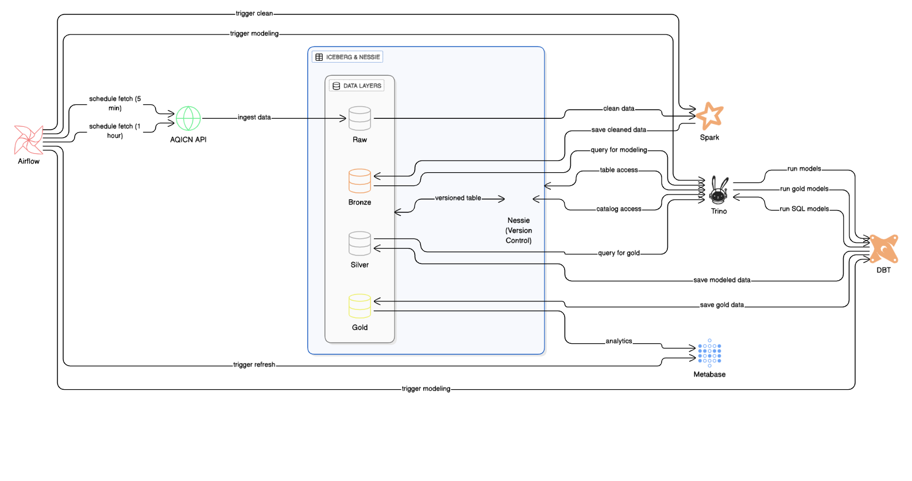
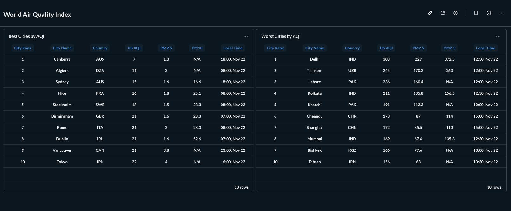

## AQI Data Lakehouse

A compact and modern end-to-end data lakehouse for Air Quality Index (AQI).

---

### Tech stack

- Python
- Airflow
- PySpark
- Apache Iceberg
- Project Nessie
- Trino
- DBT
- Metabase
- Docker (Docker Compose)

---

### How the pipeline works

- Every 30 minutes Spark ingests AQI data and writes it as-is into the Raw layer (Iceberg).
- When Raw is ready, a TriggerDagRun starts the cleaning job and loads the Bronze layer.
- After cleaning, another TriggerDagRun kicks off dbt; data is transformed with Trino + dbt (to Silver/Gold).
- Final metrics and insights are visualized in Metabase.

---

### Images

- Architecture diagram: images/architecture.png

---

#### Metabase result

